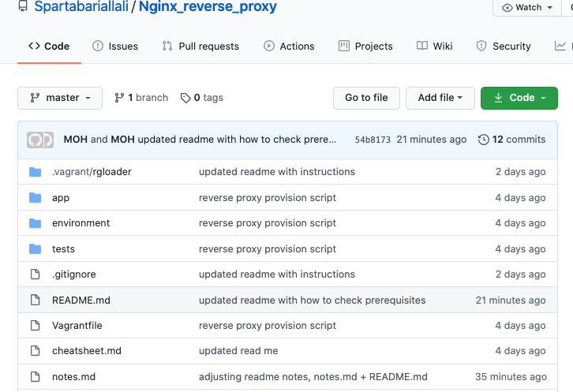

## Installation of Nodejs Application
#### Upon following the steps in this readme you will have successfully achieved:
```bash
- Creating a virtual machine running Ubuntu/Xenial64
- Run the Nodejs app with one command <--- vagrant up
- Have a successful reverse proxy listening on port 3000 and redirecting requests to port 80
```
---

### Prerequisites
- `Ruby` [download here](https://www.ruby-lang.org/en/downloads/)
- `Bundler` [download here](https://bundler.io/)
- `virtualBox` [download here](https://www.virtualbox.org/wiki/Downloads)
- `Vagrant` [download here](https://www.vagrantup.com/downloads)

#### Checking Prerequisites are installed

- Ruby

`ruby --version`

`ruby 2.6.3p62 (2019-04-16 revision 67580) [universal.x86_64-darwin19]`

- Bundler

`bundler --version`

`Bundler version 2.1.4`

- VirtualBox

`virtualbox`

`Should open the Virtualbox Manager`

- Vagrant

`vagrant --version`

`Vagrant 2.2.7`

---

### Downloading the content of this repo
- This repo contains all the files required to run the application from your local device.
- Once you have ensured all the Prerequisites are installed we need to look at getting the files to your device
- There are many ways to do this, but for simplicity we will choose to manually download the files from github as a zip folder.


1. Scroll to the top of this repo and click the code button

click the `Code` button


2. Navigate to download `Download ZIP`
[Code button](imagesmd/Screenshot 2020-08-04 at 18.45.png)
