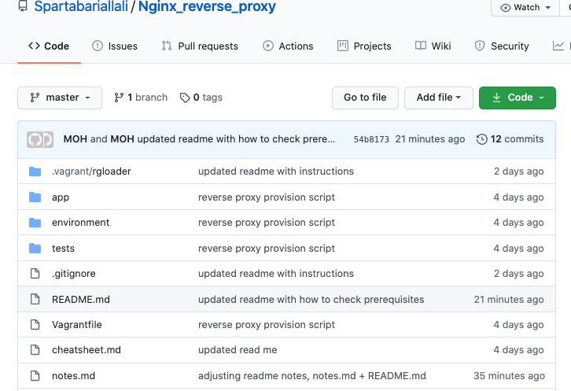
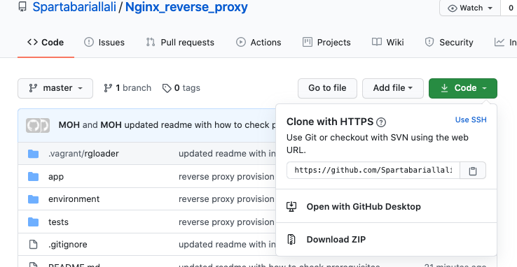

## Installation of Nodejs Application
#### Upon following the steps in this readme you will have successfully achieved:
```bash
- Creating a virtual machine running Ubuntu/Xenial64
- Run the Nodejs app with one command <--- vagrant up
- Have a successful reverse proxy listening on port 3000 and redirecting requests to port 80
```
---

### Prerequisites ***----> Please ensure you download the software relevant to your OS <----***
- `Ruby` [download here](https://www.ruby-lang.org/en/downloads/)
- `Bundler` [download here](https://bundler.io/)
- `virtualBox` [download here](https://www.virtualbox.org/wiki/Downloads)
- `Vagrant` [download here](https://www.vagrantup.com/downloads)

#### Checking Prerequisites are installed

- Ruby

`ruby --version`

`ruby 2.6.3p62 (2019-04-16 revision 67580) [universal.x86_64-darwin19]`

- Bundler

`bundler --version`

`Bundler version 2.1.4`

- VirtualBox

`virtualbox`

`Should open the Virtualbox Manager`

- Vagrant

`vagrant --version`

`Vagrant 2.2.7`

---

### Downloading the content of this repo
- This repo contains all the files required to run the application from your local device.
- Once you have ensured all the Prerequisites are installed we need to look at getting the files to your device
- There are many ways to do this, but for simplicity we will choose to manually download the files from github as a zip folder.


1. Scroll to the top of this repo and click the code button



click the `Code` button (green) on the top right hands side of the screen


2. Upon pressing the `Code` button you will be prompted with a dropdown menu
   Navigate to `Download ZIP` and this will download all the files on this repo to your local system




### ***----> Please take note of where these files are saved <----***

---

### Running the Application
- We are nearly there!
- Now that you have the files on your system we need to activate the use of the `Terminal`

#### Navigating to the files directory using Terminal
- Its imperative you remember the path to the folder where you have Unzipped the contents of the repo
- In the example below, I give the full path of where the directory is located on my machine.
- In order to navigate there I type the command `cd` followed by the full path
```bash
cd /Users/iAllali/Desktop/vagrant_solution/solution-code-environment-vars
```
- Upon running the `ls` command, you should find the contents of the directory including the following file:
```bash
vagrantfile
```
- At this stage you are ready to run the app, simply type the following command:
```bash
vagrant up
```
- Lastly, navigate to the web browser and input these links:
```bash
http://development.local/
http://development.local/posts
http://development.local/fibonacci/7
```
More information regarding `vagrant` can be found [HERE](https://github.com/Spartabariallali/Spartarepo/tree/master/vagrant_notes)
